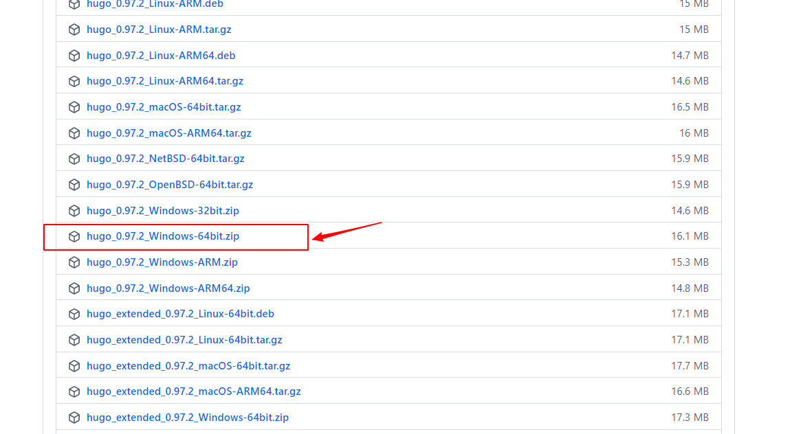
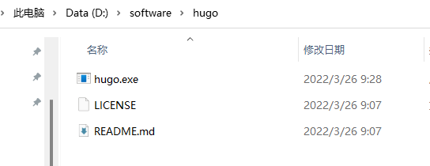
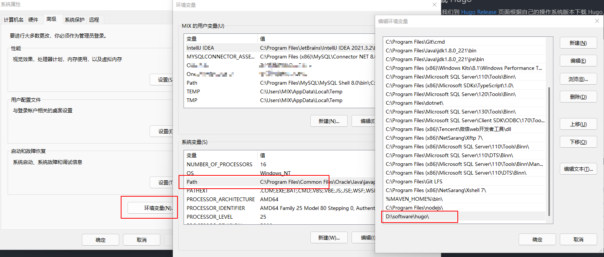
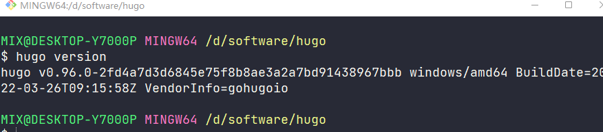
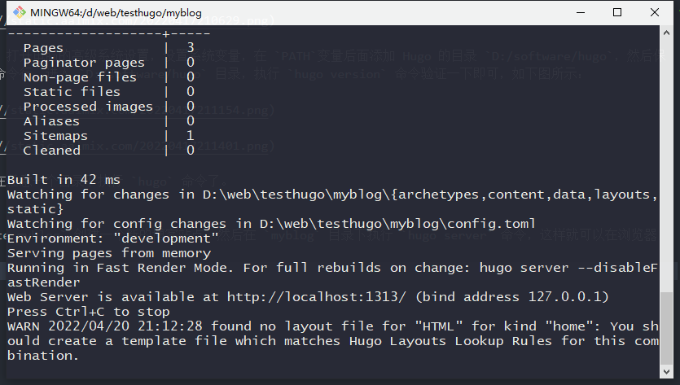
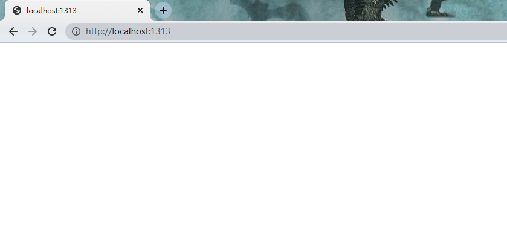
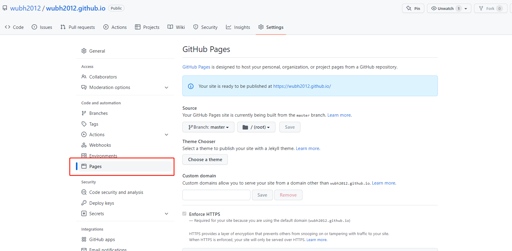
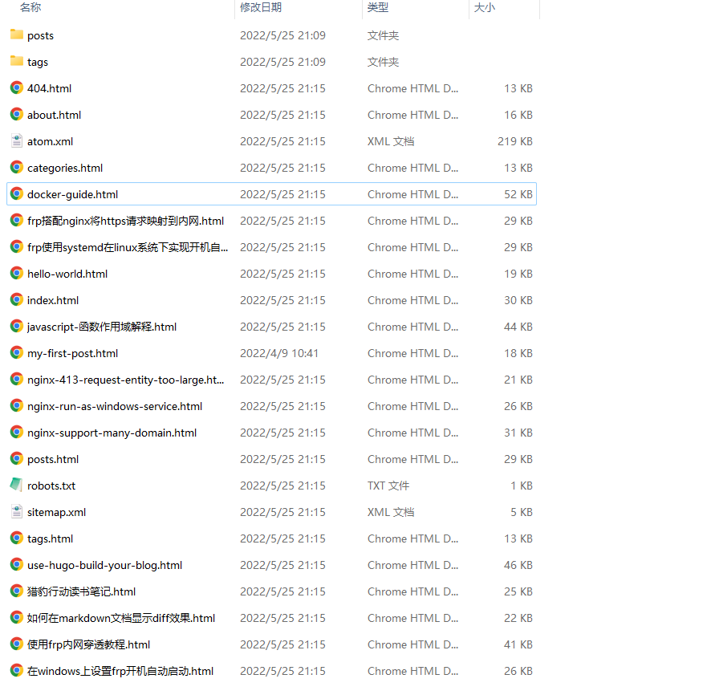
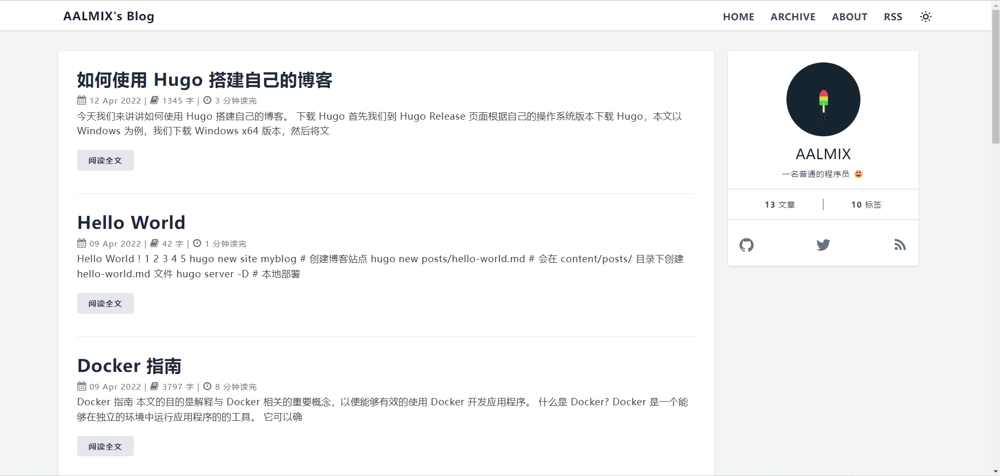

今天我们来讲讲如何使用 Hugo 搭建自己的博客。

## 下载 Hugo

首先我们到 [Hugo Release](https://github.com/gohugoio/hugo/releases) 页面根据自己的操作系统版本下载 Hugo，本文以 Windows 为例，我们下载 Windows x64 版本，然后将文件解压到 `D:/software/hugo` 目录下





然后配置一下系统的环境变量，打开电脑的高级系统设置，设置系统变量，在 `PATH`变量后面添加 Hugo 的目录 `D:/software/hugo`，然后保存，关闭系统设置，然后打开命令行，进入 `D:/software/hugo` 目录，执行 `hugo version` 命令验证一下即可，如下图所示：





配置好环境变量后我们就可以在任意一个目录下执行 `hugo` 命令了。

## 创建博客站点

我们可以使用 `hugo new site myblog` 创建一个新的博客站点，然后在 `myblog` 目录下执行 `hugo server` 命令，hugo 默认端口使用的是 1313, 我们在浏览器中输入 `http://localhost:1313` 就可以访问了如下图所示：


由于我们目前还没有写任何文章，所以看到的是一个空白的页面。


### 添加主题

在 myblog 根目录下，运行下面命令，添加主题 [hugo-theme-echo](https://github.com/forecho/hugo-theme-echo)

```
    git init # 初始化 git
    git submodule add https://github.com/forecho/hugo-theme-echo.git themes/echo
    cd themes/echo # 进入 themes/echo 目录
    npm ci # 本地开发才需要
```

### 修改 hugo 配置

大家可以根据我的 [config.toml](https://github.com/wubh2012/wubh2012.github.io/blob/master/config.toml) 文件进行修改。

```
baseUrl = "https://wubh2012.githuo.io"
languageCode = "en-us"
title = "AALMIX's Blog"
theme = "echo"
DefaultContentLanguage = "cn"
# 自动检测是否包含中文/日文/韩文，该参数会影响摘要和字数统计功能，建议设置为 true
hasCJKLanguage = true
# 设置页面生成形式，将默认的网站路径/修改成.html
uglyURLs = true
googleAnalytics = ""      # UA-XXXXXXXX-X
enableRobotsTXT = true

## 评论系统
changyanAppid = "" # Changyan app id             # 畅言
changyanAppkey = "" # Changyan app key
livereUID = "" # LiveRe UID                  # 来必力

[markup.highlight]
codeFences = true # 高亮 markdown 的代码块
guessSyntax = true # 高亮 markdown 中没有标注语言的代码块
hl_Lines = ""
lineNoStart = 1
lineNos = true
lineNumbersInTable = true
noClasses = true
style = "dracula"
tabWidth = 2

# https://gohugo.io/content-management/urls/#aliases
[permalinks]
posts = "/:filename"

[outputFormats.RSS]
mediatype = "application/rss"
baseName = "atom"

[services.rss]
limit = 20

[author]
name = "AALMIX"
avatar = "https://avatars.githubusercontent.com/u/22315624?s=400&u=0f4091c87fa6cb1f7ed21d691a5e0bc3eb0b0814&v=4"
bio = " 一名普通的程序员 😀"
homepage = "https://aalmix.com/"

[params]
favicon = "https://avatars.githubusercontent.com/u/22315624?s=460&v=4"
keywords = "AALMIX, 水果芋头,web develoment"
description = "AALMIX, aalmix blog, aalmix 独立博客，水果芋头"
toc = true
navItems = [
  ["HOME", "/"],
  ["ARCHIVE", "/posts.html"],
  ["ABOUT", "/about.html"],
  ["RSS", "/atom.xml"]
]
# rss 全文输出
rssFullContent = true
uglyURLs = true
busuanzi = true # 是否使用不蒜子统计站点访问量
staticCDNPrefix = "https://cdn.bootcss.com/font-awesome/5.11.2"
extraHead = '<script async src="https://www.googletagmanager.com/gtag/js?id=UA-xxx"></script>'
postAds = ""
#profileAds = '<div class="bg-white shadow"></div>'
notFoundAds = ''

# 开启版权声明，协议名字和链接都可以换
[params.cc]
name = "署名 - 非商业性使用 4.0 国际 (CC BY-NC 4.0)"
link = "https://creativecommons.org/licenses/by-nc/4.0/deed.zh"

# 文章打赏
[params.reward]
enable = false
title = "打赏"
wechat = "" # 微信二维码
alipay = "" # 支付宝二维码

############## 评论系统  start ##############


[params.utterances] # https://utteranc.es/
enable = true
owner = "wubh2012" # Your GitHub ID
repo = "wubh2012.github.io" # The repo to store comments
theme = "github-light"
issueterm = "pathname"

############ 评论系统  end ##############
## 社交链接
[social]
github = "wubh2012"
twitter = "twbh_wubh"
cnblogs = "wubh"
rss = "/atom.xml"
```

然后我们再运行 `hugo server -D` 命令，在浏览器中输入 `http://localhost:1313` 就可以看到我们的新博客了。
补上带图片的。

## 写下你的第一篇文章

使用命令 `hugo new posts/hello-world.md`, 会在 `content/posts/` 目录下创建一个 hello-world.md 文件，Hugo 允许你使用 yaml，toml 或者 json 语法在你每一篇文章的开头进行设置。

```
---
# 常用定义
title: "An Example Post"           # 标题
date: 2022-04-12T16:01:23+08:00    # 创建时间
lastmod: 2022-04-12T16:01:23+08:00 # 最后修改时间
draft: false                       # 是否是草稿？
tags: ["tag-1", "tag-2", "tag-3", "popular"]  # 标签
categories: ["index"]              # 分类
author: "wubh2012"                  # 作者

# 用户自定义
# 你可以选择 关闭 (false) 或者 打开 (true) 以下选项
comment: false   # 关闭评论
toc: false       # 关闭文章目录
reward: false	 # 关闭打赏
---
## Hello World!
```

然后我们再次运行 `hugo serve -D` 命令，在浏览器中输入 `http://localhost:1313/hello-world.html` 就可以看到我们的新文章了。

## 发布到 GitHub

1. 在 Github 创建一个与你账号同名的仓库，以 wubh2012.github.io 为例子
2. 在仓库中设置启用 GitPage
   
3. 首先使用 `hugo -D` 构建静态站点，默认会在 `public/` 目录下生成静态文件，将 public 文件夹的内容上传到仓库中
   
4. 访问 https://wubh2012.github.io



大工告成，恭喜你现在有一个自己的博客了！如果博客有更新只要重新上传 public 文件夹即可, 后面会教大家如何使用 GitAction 自动更新部署。
